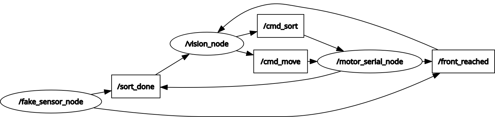

# GCS-Robot
# GCS Robot - Garbage Collection & Sorting Robot

An autonomous garbage collection and sorting robot built using ROS2, Computer Vision, and embedded systems.

The robot is designed to detect waste objects, follow them autonomously, and perform sorting decisions based on object classification. The system combines ROS2 communication, finite state machine logic, and YOLO-based object detection to simulate a complete robotic workflow.

---

# Features

- ROS2-based modular architecture
- Real-time object detection using YOLO
- Autonomous object-following logic
- Finite State Machine (FSM) control system
- Serial communication with motor controller
- Sorting decision system
- ROS2 topic-based communication
- Simulation workflow demonstration

---

# Technologies Used

- ROS2
- Python
- OpenCV
- YOLOv8
- TCP Communication
- Serial Communication
- Raspberry Pi
- Arduino Mega

---

# System Architecture

The following diagram illustrates the communication between ROS2 nodes and topics inside the system.



The architecture is divided into three main nodes:

## vision_node
Responsible for:
- Object detection
- Decision making
- FSM state transitions
- Publishing movement and sorting commands

Published Topics:
- `/cmd_move`
- `/cmd_sort`

Subscribed Topics:
- `/front_reached`
- `/sort_done`

---

## motor_serial_node
Responsible for:
- Receiving movement commands
- Sending serial commands to the motor controller
- Publishing movement completion states

Subscribed Topics:
- `/cmd_move`
- `/cmd_sort`

Published Topics:
- `/front_reached`
- `/sort_done`

---

## fake_sensor_node
Used during simulation to emulate sensor feedback and state transitions.

Published Topics:
- `/front_reached`
- `/sort_done`

---

# Finite State Machine (FSM)

The robot logic is based on three main states:

## SEARCH
The robot searches for detectable waste objects using the vision system.

## MOVE
The robot moves toward the detected target object.

## SORT
The object is classified and sorted into the correct category.

---

# Simulation

The simulation demonstrates:

- ROS2 node communication
- Topic-based architecture
- YOLO object detection
- FSM transitions
- Movement decision logic
- Sorting workflow simulation

## Simulation Video

[Simulation Demo Video](https://drive.google.com/file/d/1CyD6YoHmvctcM6G5tmuo2YAE6F5eVTSw/view?usp=sharing)

---

# Project Structure

```text
GCS-Robot/
├── images/
├── fake_sensor_node.py
├── motor_serial_node.py
├── vision_node.py
├── package.xml
├── setup.py
├── setup.cfg
└── README.md
```

---

# Future Improvements

- Full Gazebo simulation
- SLAM integration
- Real sensor integration
- Custom-trained waste detection model
- Autonomous navigation system
- Web-based monitoring dashboard

---

# Team

Garbage Collection & Sorting Robot (GCS Robot)  
Faculty of Engineering - Mansoura University

---
